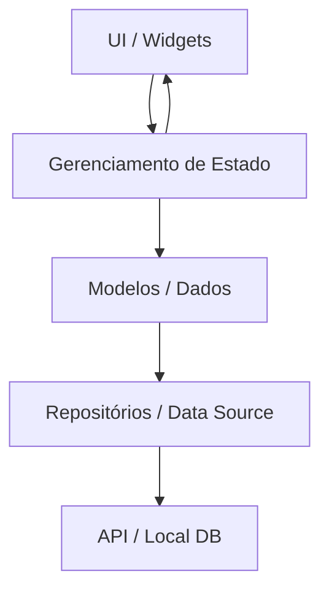

# state-management-flutter
Flutter State Management Study case

# 📌 Gerenciamento de Estado em Flutter

🧩 Conceito

O gerenciamento de estado é o coração de qualquer aplicação Flutter. Estado significa qualquer informação que pode mudar durante a execução do app (ex: itens de uma lista, usuário logado, tema claro/escuro).
A escolha da ferramenta de gerenciamento de estado impacta diretamente na organização, escalabilidade e testabilidade do projeto.

O gerenciamento de estado é um dos tópicos mais importantes no desenvolvimento de aplicativos Flutter. Ele define **como a interface do usuário reage às mudanças nos dados** e garante previsibilidade, organização e manutenibilidade no código.

Este material apresenta os principais padrões e bibliotecas utilizados no ecossistema Flutter, com conceitos, comparações, diagramas e exemplos práticos.

---

## 🎯 O que é Gerenciamento de Estado?

- **Estado**: qualquer dado que pode mudar durante o ciclo de vida da aplicação (ex: usuário autenticado, itens de uma lista, valor de um contador).
- **Gerenciamento de Estado**: técnicas e ferramentas para controlar como essas mudanças refletem na UI e em outras partes do sistema.

O Flutter oferece flexibilidade: desde soluções simples com `setState` até arquiteturas robustas como `BLoC` ou `Riverpod`.

---

## 🔄 Comparativo entre Abordagens

| Solução   | Complexidade | Escalabilidade | Testabilidade | Comunidade |
|-----------|--------------|----------------|---------------|------------|
| Provider  | Baixa        | Média          | Alta          | Alta       |
| Riverpod  | Média        | Alta           | Alta          | Alta       |
| BLoC/Cubit| Alta         | Muito Alta     | Muito Alta    | Muito Alta |
| GetX      | Baixa        | Média          | Média         | Alta       |
| MobX      | Média        | Média          | Média         | Média      |

---

## 📊 Fluxo de Dados (Genérico)



---

## 🧩 Principais Abordagens

### 1. **Provider**
- Oficialmente recomendado pelo time do Flutter (baseado em InheritedWidget).
- Simples de configurar e muito usado em projetos de pequeno a médio porte.

**Exemplo prático:**
```dart
class Counter with ChangeNotifier {
  int value = 0;
  void increment() {
    value++;
    notifyListeners();
  }
}

// Provider na árvore de widgets
ChangeNotifierProvider(
  create: (_) => Counter(),
  child: MyApp(),
);

// Consumo
Consumer<Counter>(
  builder: (_, counter, __) => Text('${counter.value}'),
);
```

---

### 2. **Riverpod**
- Evolução do Provider, mais flexível e com melhor escalabilidade.
- Suporte a dependências entre provedores e mais facilidade nos testes.

**Exemplo prático:**
```dart
final counterProvider = StateProvider<int>((ref) => 0);

// Consumo
Consumer(
  builder: (context, ref, _) {
    final counter = ref.watch(counterProvider);
    return Column(
      children: [
        Text('$counter'),
        ElevatedButton(
          onPressed: () => ref.read(counterProvider.notifier).state++,
          child: Text("Incrementar"),
        )
      ],
    );
  },
);
```

---

### 3. **BLoC / Cubit**
- Baseado no padrão **Business Logic Component**.
- Ideal para projetos grandes que exigem separação clara entre camadas.
- `Cubit` é uma versão simplificada do `Bloc`.

**Exemplo com Cubit:**
```dart
class CounterCubit extends Cubit<int> {
  CounterCubit() : super(0);
  void increment() => emit(state + 1);
}

BlocProvider(
  create: (_) => CounterCubit(),
  child: BlocBuilder<CounterCubit, int>(
    builder: (_, count) => Column(
      children: [
        Text('$count'),
        ElevatedButton(
          onPressed: () => context.read<CounterCubit>().increment(),
          child: Text("Incrementar"),
        )
      ],
    ),
  ),
);
```

---

### 4. **GetX**
- Focado em simplicidade e performance.
- Oferece **state management**, **injeção de dependência** e **navegação**.
- Muito popular em projetos pequenos/médios pela curva de aprendizado rápida.

**Exemplo prático:**
```dart
class CounterController extends GetxController {
  var count = 0.obs;
  void increment() => count++;
}

final controller = Get.put(CounterController());

Obx(() => Text('${controller.count}')),
ElevatedButton(
  onPressed: controller.increment,
  child: Text("Incrementar"),
)
```

---

### 5. **MobX**
- Baseado no conceito de **observables** e **reactions**.
- Muito usado em outros ecossistemas (ex: React), menos comum em Flutter.

**Exemplo prático:**
```dart
class Counter = _Counter with _$Counter;

abstract class _Counter with Store {
  @observable
  int value = 0;

  @action
  void increment() => value++;
}

final counter = Counter();

Observer(
  builder: (_) => Text('${counter.value}'),
);
```

---

## 📂 Estrutura sugerida de repositório

```
lib/
 ├── models/
 ├── providers/   # Provider/Riverpod
 ├── blocs/       # Bloc/Cubit
 ├── controllers/ # GetX
 ├── stores/      # MobX
 └── views/
```

---

## 📚 Conclusão

- Não existe solução **única** para todos os cenários.
- Para apps pequenos → **Provider** ou **GetX**.
- Para apps médios → **Riverpod**.
- Para grandes projetos corporativos → **BLoC/Cubit**.
- MobX pode ser usado, mas é menos comum no ecossistema Flutter.

🔗 **Referência oficial:** [Gerenciamento de Estado - Flutter Docs](https://docs.flutter.dev/development/data-and-backend/state-mgmt/intro)


